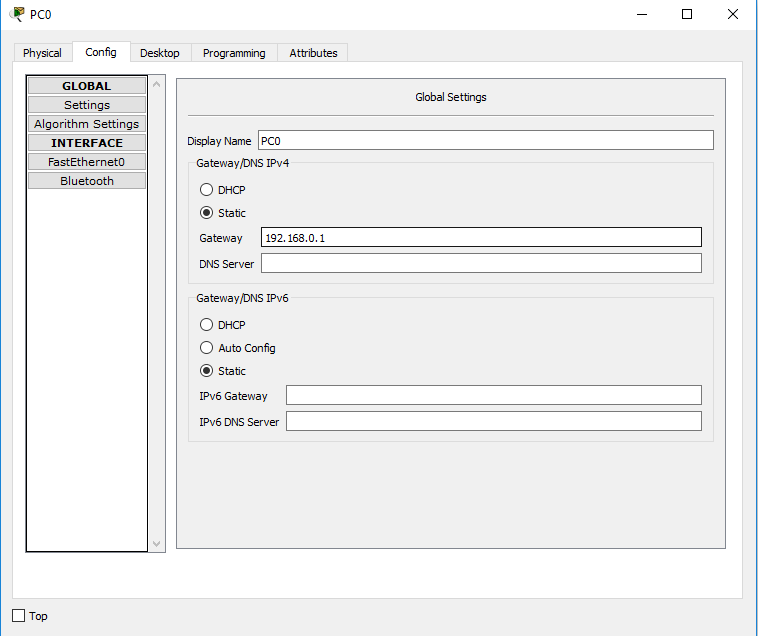
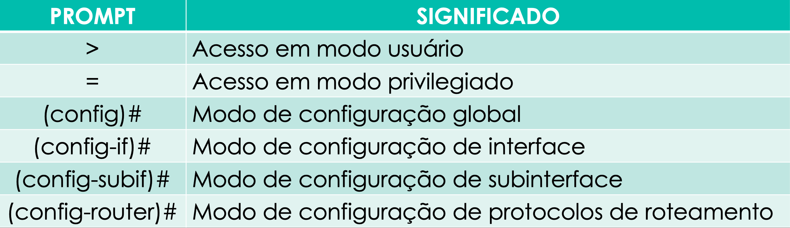
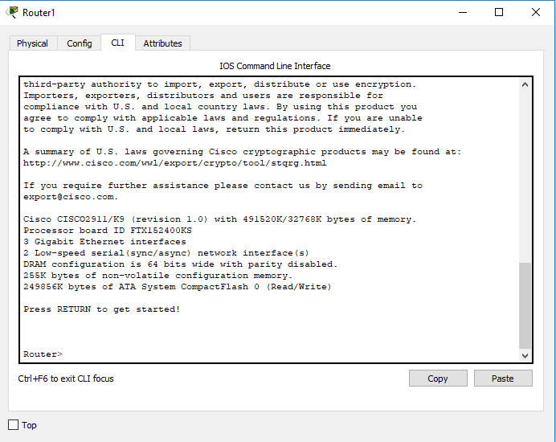
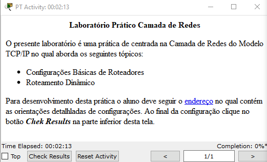
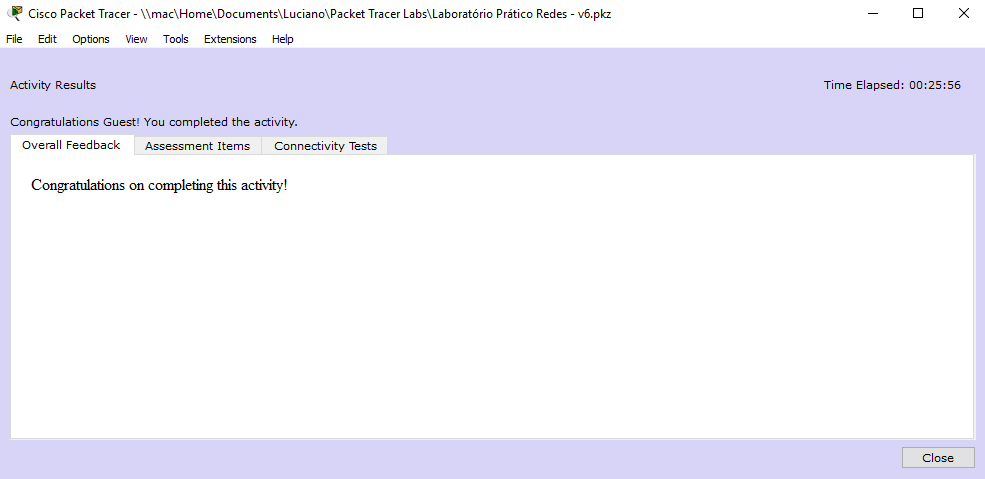
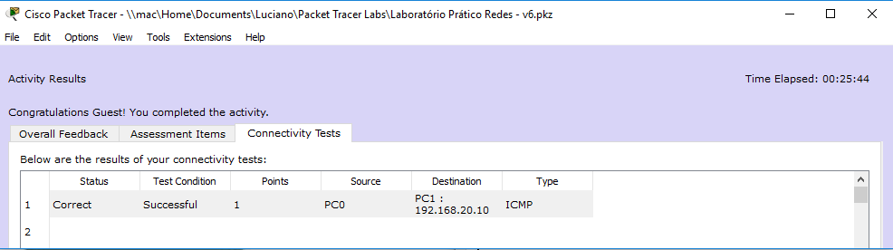

# 
 LABORATÓRIO CAMADA DE REDES

<h2 align="left">1 - Introdução</h2>

A Camada de Rede foca na interconexão de enlaces e redes distintas, e para resolver este problemas, são necessários dois personagens: Os protocolos de roteamento e os dispositivos de interconexão de enlaces (switchs ou roteadores)

<h2 align="left">2 - Sistemas Autônomos</h2>

Sistemas Autônomos (SA) são agrupamentos de roteadores administrados por um roteador central, geralmente o que está executando o protocolo BGP, conforme Figura 01, podemos observar um grupo de 3 (três) Sistemas Autônomos.

A Estrutura da Internet feita em Sistemas Autônomos dimimuita a quantidade de tabelas de roteamento replicadas, considerando que as informações inerentes as rotas interna a um SA reservam-se aos seus roteadores de borda.

<h4 align="middle">Figura 01 - Sistemas Autônomos</h4>
<h2 align="left">3 - Roteamento Estático</h2>

O roteamento dinâmico interconecta redes distintas, todavia, sua configuração é realizada pelo administrador do ambiente, devendo criar as rotas necessárias em cada roteador da rede, caso ocorra alguma queda do enlace os pacotes continuaram sendo encaminhados para o enlace descontinuada, somente depois da intervenção do administrador criando uma nova rota é que o problema será solucionado.

<h2 align="left">4 - Roteamento Dinâmico</h2>

O Roteamento Dinâmico as tabelas são criadas automáticamente pelo algoritmo de roteamento, sem intervenção do administrador do ambiente, devendo a este informar somente qual protocolo de roteamento deve-se utilizar. Os protocolos de roteamento dinâmicos utilizados na camada de rede são:

* <b>RIP</b> – Utilizada como característica para escolha da rota o caminho mais curto, baseado na quantidade de saltos, é um protocolo interno ao Sistema Autônomo;

* <b>OSPF</b> – Tem como caracterísitca para escolha da rota o estado do enlace, que nem sempre é o caminho mais curto é um protocolo interno ao Sistema Autônomo;

* <b>BGP</b> -  Protocolo de Borda que Interconecta Sistemas Autônomos;

<h2 align="left">5 - Laboratório Roteamento Dinâmico</h2>

Iremos realizar a interconexão de duas redes distintas, Figura 2, usando um protocolo de roteamento dinâmico RIP, que utiliza o algoritmo de Vetor de Distância, ou seja, o melhor caminho é o que possui a menor quantidade de saltos</b>

<h4 align="middle">Figura 02 - Diagrama Rede</h4>

<h3 align="left">5.1 - Entendo a Arquitetura de um Roteador</h3>

Um roteador é um compador com função específica de interconectar redes, seu hardware funciona de uma maneira um pouco difererente de um computador pessoal, um dos principais fabricantes do mercado é a CISCO, no qual nosso laboratório estará orientado, a Figura 03, apresenta a arquitetura dos componentes principais de um roteador. 

<h4 align="middle">Figura 03 - Componentes Roteador</h4>

*  <b>RAM</b> – Armazena as tabelas de roteamento e o arquivo de configuração temporário do roteador;

* <b>NVRAM</b> – Armazena o arquivo de configuração que será utilizado na inicialização (startup config), não ocorre perca das informações armazenadas na NVRAM ao desligar o roteador;

* <b>FLASH</b> - Armazena a imagem de inicialização do Sistema Operacional, possui a possibilidade armazenar várias imagens, retém seu conteúdo quando o roteador é desligado;

* <b>ROM</b> -  Mantém instruções que definem o autoteste realizado na inicialização do roteador;

* <b>Console</b> -  É uma interface de acesso direto ao roteador para sua manutenção e atualização de firmware em caso de percado de acesso externo;

* <b>Interfaces</b> -  Conectam o roteador à rede para entrada e saída de pacotes, podem estar diretamenta conectadas na placa-mãe ou adicinadas através de módulos, em computadores pessoas são chamadas de placas de rede;

Todas as configurações realizadas em um roteador são salvas na RAM, portanto é um dado volátil, ocorrendo o desligamento inesperado a configuração feita é <b>PERDIDA</b>, daí a necessidade de salvar constante o que foi realizado na NVRAM através do comando: <i>copy running-config startup-config</i>.

<h3 align="left">5.2 - Preparando o Ambiente para Realizar o Laboratório</h3>

Iremos utilizar um software de simualação de rede desenvolvido e disponibilizado pela própria CISCO, chamado Packet Tracer, ele pode ser executado até mesmo em computadores antigos de 32 bits, para fazer o download cadastre-se no curso:

[Introduction to Packet Tracer](https://www.microsoft.com/pt-BR/download/details.aspx?id=45520)

É um curso gratuíto de 10 horas, que não tem obrigatoriedade de sua realização, mas já disponibiliza conteúdo e a o download da ferramenta. O mais importante é que você pode até achar o arquivo de instalação do Packet Tracer na internert, todavia para liberar todas as funcionalidades da ferramenta é necessário um login criado no cadastro deste curso, vou disponiblizar a seguir o arquivo para download direto que salvei no google drive:

[Packet Tracer - 32 bits](https://drive.google.com/open?id=10PJHweyAjtvTW5J4JWVAGVdsNSeJKk9f)

[Packet Tracer - 64 bits](https://drive.google.com/open?id=1v3oJeTjKZX5XFH3iwGnDYITVQ1u1FQG_)

[Packet Tracer - Linux](https://drive.google.com/open?id=10dGsuiEm2PqPYw1F5qqx2Pkdquy4sOBQ)

Após o download faça a instalação do aplicativo que é muito simples, realize o login no mesmo, é o usuário que você cadastrou para ter acesso ao curso, e faça o download do arquivo do laboratório disponiblizado abaixo:

[Laboratório - Roteamento Dinâmico RIP](https://drive.google.com/open?id=1H6cVuwK_GAYC0BXm2RTWAelJVvFJ1O6D)

Menu Options => Preferences
 
<h3 align="left">5.3 - Execução do Laboratório</h3>

Ao abrir o arquivo baixado no link acima, o Packet Tracer será aberto com duas telas, uma com o wizard que apresentará seus acerto no final e a outra com o diagrama de rede no qual você irá configurar, Figura4. 

<h4 align="middle">Figura 04 - Laboratório Packet Tracer</h4>

Objetivo do Laboratório:

*  Congigurar o endereçamento IP em todos os dispositivos do ambiente;

* Configurar o Roteamento Dinâmico RIP no <b>Router1</b> e <b>Router2</b> para que o <b>PC0</b> possa se comunicar com o <b>PC1</b>;

<h3 align="left">5.4 - Configuração do PC0</h3>

Seguiremos uma dinâmica no laboratório de configuração por dispositivo, acessa o dispositivo realiza todas as configurações inclusive de roteamento, se for o caso, e passa a fazer a configuração do seguinte, lembrado que o diagrama e endereçamento é o igual o apresentado na Figura 02.

O ambiente de rede apresentado não possui nenhuma configuração, somente foi acrescentado um módulo para disponibilizar uma comunicação serial entre os roteadores, acessem o <b>PC0</b> dando dois cliques em cima de uma imagem, onde será apresentado a imagem conforme Figura 05, com suas guias de configuração.

<h4 align="middle">Figura 05 - Configuração PC</h4>

Acesse a guia <b>config</b> no menu <b>Settings</b> e atribuia o endereço do Gateway do PC0 que é a interface Gigabitethernet 0/0 com IP 192.168.0.1, Figura 06:

<h4 align="middle">Figura 06 - Configuração PC - Gateway</h4>

No menu Interface => FastEthernet0 atribua o endereço conforme diagrama de redes, Figura 07: 

<h4 align="middle">Figura 07 - Configuração PC - Endereço IP</h4>

<h3 align="left">5.5 - Configuração do Router1</h3>

A configuração de um Router da CISCO é completamente diferente de qualquer sistema operacional de computadores pessoais ou roteadores domésticos, ele possui um Sistema Operacional própio chamado Internetwork Operating System (IOS) presente também em Switchs da cisco, o importante de suas configurações é enteder a localização quanto aos prompts. Outro as pectos a se considerar é que a administração deste sistema operacional é realizada utilizando linhas de comandos através da Command Lina Interface-CLI, a tabela abaixo apresenta os principais prompts utilizados no IOS:

Para configurar o <b>Router1</b> clique duas vezes em cima de sua imagem, será aberto uma tela com as guias de configurações físicas, lógicas e CLI, Figura 8:

<h4 align="middle">Figura 08 - Configuração Router</h4>

Toda a administração do roteador será feita na guia <b>CLI</b>, no qual será disponibilizado o prompt de administração, Figura 9, o <b>CLI</b> estará bloqueado para ter acesso digite <b>enter</b>, onde será liberado o <b>prompt modo usuário</b> (>).

<h4 align="middle">Figura 09 - Configuração Router - CLI</h4>

Por questões de padronização deixei o texto referente ao Prompt do IOS em negrito, caracterizando que não deve ser digitado na CLI

Ao acessar a <b>CLI</b> pela primeira vez o prompt liberado é o <b>modo usuário</b>, todavia neste prompt só podemos realizar consultas, para administrar e configurar o router, deve-se acessar o prompt <b>modo priviletiado</b> digitando o comando: enable

<b>Router></b>  enable


Para realizar configuração no router devemos acessar o prompt no <b>Modo de Configuração Global</b> digitando: configure terminal ou conf t

<b>Router#</b> configure terminal


Para atribuir o endereço ip a uma interface deve-se acessar seu prompt de acordo a porta da interface conforme apresentado, em nosso laboratório iremos acessar a interface GibabitEthernet 0/0 que conecta o Router1 ao PC0

<b>Router(config)#</b> interface gigabitethernet 0/0

Deve-se atribuir o endereço conforme apresentado

<b>Router(config-if)#</b> ip address 192.168.0.1 255.255.255.0

<b>Obs.: </b>Caso digite qualquer comando errado, como o endereço da interface, por exemplo: ip address 192.168.0.10 255.255.255.0, basta repetir o comando com a palavra <b>no</b> no começo: <b>no</b> ip address 192.168.0.10 255.255.255.0, e digitar o comando correto.

Toda interface por padrão vem desligada, após atribuir o endereçamento deve-se digitar o comando: no shutdown ou no shut

<b>Router(config-if)#</b> no shutdown


Saia do prompt da interface com o comando: exit

<b>Router(config-if)#</b> exit

Acesse o prompt da interface serial 0/3/0

<b>Router(config)#</b> interface serial 0/3/0

Atribua o IP conforme especificado na Figura 2

<b>Router(config-if)#</b> ip address 192.168.10.1 255.255.255.0

Ative a interface

<b>Router(config-if)#</b> no shutdown


Saia do Prompt

<b>Router(config-if)#</b> exit

Neste ponto será configurado o protocolo de Roteamento RIP, que é um protocolo dinâmico que constroi sua tabela de roteamento baseada no estado do enlace, para acessar o prompt de roteamento digite o comando: router rip

<b>Router(config)#</b> router rip

Deve-se informar todas as redes que estão diretamente conectada no roteador, eles possam anunciá-las

<b>Router(config-router)#</b> network 192.168.0.0

<b>Router(config-router)#</b> network 192.168.10.0

Para reduzir a quantidade de anúncios de rede e atividades de processamento do router, deve-se informar quais são as <b>interfaces passivas</b> que não necessitaram anunciar redes, geralmente são interfaces que não estão conectadas a roteadores, como a GigaBitEthernet 0/0.

<b>Router(config-router)#</b> passive-interface giGabitethernet 0/0

<b>Obs.: </b>Caso faça algum parâmetro errado no prompt de roteamento, basta apagar toda a configuração de roteamento digitando no prompt de configuracão global: no router rip

Saia do prompt de roteamento

<b>Router(config-router)#</b>  end


Todas as configurações realizadas anteriormentes estão sendo salvas de maneira automática no arquivo <b>running-config</b> na RAM, em caso de desligamento inesperado tudo o que foi digitado seria perdido, para que a configuração seja salva copie o arquivo running-config para o arquivo <b>startup-config</b> na NVRAM.

<b>Router#</b> copy running-config startup-config

É pedido uma confirmação da cópia, basta digitar enter

Destination filename [startup-config]?
 
Building configuration...
[OK]

<h3 align="left">5.6 - Configuração do Router1</h3>

A configuração do Router2 é similitar ao Router1, a única diferença são os parâmetros de configuração, portanto não irei repetir as explicações, somente repassar o comando, com excessão quando irei usar o <b>clock rate</b>
 

<b>Router></b>  enable



<b>Router#</b> configure terminal



<b>Router(config)#</b> interface serial 0/3/0


<b>Router(config-if)#</b> ip address 192.168.10.2 255.255.255.0

O <b>clock rate</b> define a taxa de bits transmitida na interface serial que opera no modo de Equipamento de Comunicação de Dados-DCE, caso este parâmetro não seja configurado não ocorrerá comunicação entre os roteadores.

<b>Router(config-if)#</b> clock rate 56000


<b>Router(config-if)#</b> no shutdown


<b>Router(config-if)#</b> exit

<b>Router(config)#</b> interface GigabitEthernet 0/0

<b>Router(config-if)#</b> ip address 192.168.20.1 255.255.255.0

<b>Router(config-if)#</b> no shutdown


<b>Router(config-if)#</b> exit


<b>Router(config)#</b> router rip


<b>Router(config-router)#</b> network 192.168.10.0

<b>Router(config-router)#</b> network 192.168.20.0


<b>Router(config-router)#</b> passive-interface GigabitEthernet 0/0

<b>Router(config-router)#</b>  end



<b>Router#</b> copy running-config startup-config


Destination filename [startup-config]?
 
Building configuration...
[OK]

<h3 align="left">5.7 - Configuração do PC1</h3>

A configuração do PC1 é similar ao PC0, necessitando somente usar o gateway conforme o diagrama de rede <b>192.168.20.1</b> e o endereço ip do computador <b>192.168.20.10</b>.

<b>Obs.:</b> Em caso de dúvida volte no tópico 5.4, para ver como acessar a área de configuração do PC

<h3 align="left">5.8 - Analisando se a Configuração está Correta</h3>

Para verificar se a configuração está correta acesse novamente o PC0 dando dois cliques na imagem, será aberto a caixa de configuração, Figura 05, selecione a guia <b>Desktop</b> e <b>Prompt de Comando</b> dentro do terminal aberto digite o comando: ping 192.168.20.10, se a configuração estiver correta não ocorrerá perca de nenhum pacote

A analise dos resultados de toda a configuração é feita clicando no botão <b>Check Results</b>, Figura 10

<h4 align="middle">Figura 10 - Check Results</h4>

No qual será aberto uma caixa de diálogo com três guias de relatórios: Feedback Geral, Itens Corretos e Teste de Conectividades, conforme imagens abaixo:

<h3 align="left">5.9 - Comandos Importantes</h3>

Alguns comandos importantes serão apresentados a seguir, todos eles devem ser executados no prompt privilegiado:

*  <b>show running-config</b> – Apresenta o arquivo de configuração do router que está executando na RAM;

* <b>show startup-config</b> – Apresenta o arquivo de configuração que está salvo na NVRAM e que será carregado na inicialização do router;

* <b>show ip route</b> - Exibe as todas as tabelas de roteamentos montatas pelo router;

